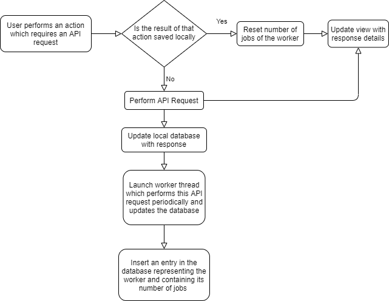

**Problem :** Navigation through out the app requires multiple API requests, which take time to process (http request + parsing from siren). For example, right now, going from courses to classSection requires 4 API requests which is a lot, and this a very common action within the app.

**Solution**: Saving data, which is not frequently altered, locally.
This is the ideal solution, but it's not viable since there is data that doens't changed for years, e.g: the details of a course. This means that our local database would have to save details from all courses from all programmes. And since the memory of the typical smartphone is very limited this would be a bad ideia. The solution is a hybrid, save some data locally and some remotely. 

**But which data should be saved and which shouldn't?**

Well that decision comes from the user. A student which frequents the second curricular term of LEIC will probably need the information of the classes from that particular term to always be up to date. Another example would be the user favorites, those should also always be up to date.

**What if a term ends, should the details of the favorite classes from that term still be saved?**

The answer is no, the user will probably never go to the details of those classes ever again. This means that the information must also be removed from the local database. 

**What about the classes which the user goes to once?**

Well, in this case, the information should be retrieved from the API and not saved locally.  
